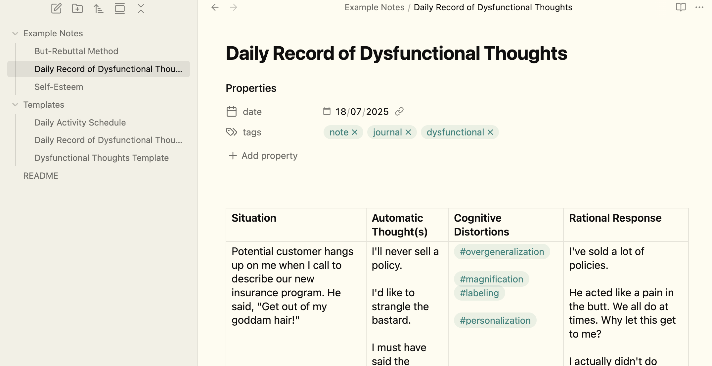

# Therapy with Obsidian

This GitHub repository is an example vault that applies the techniques and principles from the book **Feeling Good** by Dr. David Burns in [Obsidian](https://obsidian.md), a note-taking app.

### Screenshot

### Get started

1. Download and install Obsidian from [here](https://obsidian.md/download).
2. [Download this vault](https://github.com/anuwup/feeling-good-obsidian/archive/refs/heads/main.zip)
3. Unzip the .zip file to a folder of your choosing
4. Open Obsidian and create a new vault pointing to that folder

### Keyboard Shortcuts

- `ctrl/cmd + T` to insert any of the templates in the `Templates` folder.
- `ctrl/cmd + shift + J` to insert a unique note with date and timestamp in the title. The template used for this note is the `Dysfunctional Thoughts Template`.

See example notes for how to use the different techniques mentioned in the book.

### Configuration

You can change the template used in the **Unique Note Creator** plugin settings to other templates in the `Templates/` folder. 

## Thanks

1. **David Burns** for the **Feeling Good** book and podcast.
2. **[Flexoki](https://www.stephango.com/flexoki)** and **Obsidian**